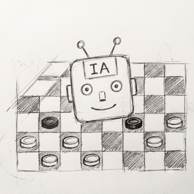

# Damas Brasileiras com IA



Este é um software completo para o Jogo de Damas na regra brasileira (64 casas), desenvolvido em C++ com a biblioteca Qt para a interface gráfica. O projeto inclui um motor de Inteligência Artificial (IA) robusto com capacidade de aprendizado e análise.

Link das bases_de_finais -> "https://drive.google.com/drive/folders/1MnYZOAaEBEhyNRCnFheogO0NTuWrDu3M?usp=sharing". 
As bases de finais, devem ser colocadas na pasta /opt/lib-engine/db

## 🚀 Recursos

*   **Interface Gráfica Completa:** Interface intuitiva construída com Qt 6.
*   **Motor de IA Avançado:**
    *   Busca Alpha-Beta com otimizações (PVS, Null Move, etc.).
    *   Tabela de Transposição para acelerar os cálculos.
    *   Heurísticas de ordenação de lances (Killer Moves, History Heuristic).
*   **Aprendizado Contínuo:**
    *   **Correção de Lances (`Ctrl+L`):** Ensine a IA a evitar erros e a preferir lances melhores.
    *   **Livro de Aberturas (`Ctrl+B`):** Personalize as aberturas da IA, definindo pesos para cada lance.
    *   **Memória Fotográfica:** A IA memoriza posições vencedoras e perdedoras para reconhecimento instantâneo.
*   **Suporte a Finais (EGTB):** Integração com bases de finais (Endgame Tablebases) para um jogo perfeito em finais com até 6 peças.
*   **Modos de Jogo:**
    *   Humano vs Humano
    *   Humano vs IA
    *   IA vs Humano
    *   IA vs IA
*   **Modo Análise:** Deixe a IA analisando uma posição indefinidamente para encontrar a melhor linha de jogo.
*   **Modo Montagem:** Crie qualquer posição no tabuleiro para estudo, treinamento ou resolução de problemas.
*   **Compatibilidade:** Salve e carregue jogos no formato **PDN** (Portable Draughts Notation) e posições no formato **FEN** (Forsyth-Edwards Notation).
*   **Empacotamento:** Script para gerar um pacote de instalação `.deb` para distribuições baseadas em Debian (Ubuntu, Mint, etc.).

## 🛠️ Compilando e Executando (Linux)

### 1. Dependências

Você precisará das seguintes ferramentas e bibliotecas. Em sistemas baseados em Debian/Ubuntu, instale com:

```bash
sudo apt-get update
sudo apt-get install build-essential cmake qt6-base-dev libzstd-dev alsa-utils
```

### 2. Compilação

Navegue até a pasta `qt` e use o CMake para compilar o projeto:

```bash
cd /caminho/para/o/projeto/qt

mkdir build
cd build

cmake ..
make
```

### 3. Execução

O executável `damas_app` será criado dentro da pasta `build`. Execute-o a partir de lá:

```bash
./damas_app
```

## 📦 Empacotamento (Gerando um .deb)

O projeto inclui um script para criar um pacote de instalação `.deb` facilmente distribuível.

1.  Certifique-se de que o projeto foi compilado com sucesso.
2.  Execute o script `create_deb.sh` a partir da pasta `qt`:

```bash
cd /caminho/para/o/projeto/qt
./create_deb.sh
```

Um arquivo `lib-engine_1.4_amd64.deb` será gerado. Você pode instalá-lo com:

```bash
sudo dpkg -i lib-engine_1.4_amd64.deb
# Se houver erros de dependência, resolva-os com:
sudo apt -f install
```
Caso exista uma versão anterior, a pasta "data" será protegida para não perder a evolução da IA.
Para desinstalar, o nome do pacote é "lib-engine".

Após a instalação, o jogo estará disponível no menu de aplicativos do seu sistema.

## 🧠 Usando as Funções de Aprendizado

*   **Corrigir um Lance da IA (`Ctrl+L`):**
    1.  Quando a IA fizer um lance que você considera ruim, **pressione `Ctrl+L`**.
    2.  O lance da IA será desfeito.
    3.  Jogue no lugar dela o lance que você acha que ela deveria ter feito.
    4.  O jogo continuará a partir do seu lance corrigido, e a IA aprenderá com a correção.

*   **Adicionar ao Livro de Aberturas (`Ctrl+B`):**
    1.  Durante os 10 primeiros lances do jogo, faça um movimento que você queira ensinar à IA.
    2.  Imediatamente após o lance, **pressione `Ctrl+B`**.
    3.  Uma caixa de diálogo pedirá um "peso" (1-100). Um peso maior torna o lance mais provável.
    4.  O lance será salvo no livro de aberturas da IA.

## ❤️ Créditos

*   **Desenvolvimento:** 

Emanoel Libonati, 

Ezequiel Libonati

Se você gostou deste software, considere apoiar o projeto com uma doação.

*   **Chave PIX:** `brasillinux20@gmail.com`

---
